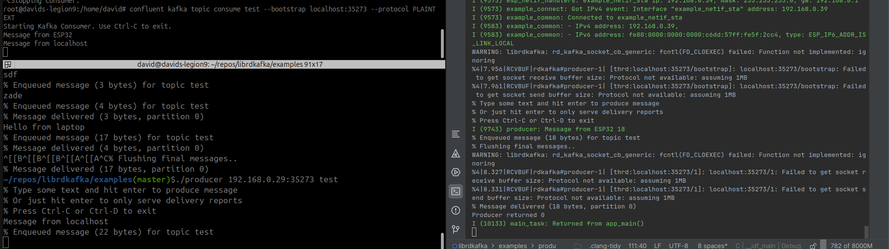

# rdkafka

Embedded Kafka client -- port of librdkafka to ESP-IDF

This repository provides a vary simple ESP32 port of **librdkafka**.

## Quickstart

Here are two simple ways to connect your ESP32 test setup to a Kafka cluster using **PLAINTEXT transport**:

---

## Option 1: Install and Run a Local Kafka Instance (via Confluent CLI)

### Prerequisites
- Docker Desktop installed and running
- Confluent CLI installed and available in your `PATH`

### Steps

1. **Start local Kafka with PLAINTEXT on a fixed port**

```bash
confluent local kafka start --plaintext-ports 9092
```

This command starts a local Kafka broker (in Docker) that accepts plaintext connections on port 9092.
By default, Confluent CLI uses PLAINTEXT for producer/consumer unless otherwise configured

2. **Create a topic named TEST**

```
kafka-topics --bootstrap-server localhost:9092 --create --topic TEST --partitions 1 --replication-factor 1
```

3. **Run a plaintext consumer from TEST**

```
kafka-console-consumer --bootstrap-server localhost:9092 --topic TEST --from-beginning
```

4. **Run a plaintext producer to TEST**

```
kafka-console-producer --broker-list localhost:9092 --topic TEST
```

5. **ESP32 Connection Details**

> Protocol: PLAINTEXT
> Host: host name of the machines that runs kafka
> Port: 9092

## Option 2: Use Confluent Cloud Free Tier

1. Visit the [confluence](https://docs.confluent.io/confluent-cli/4.35/overview.html) to register for a free-tier Kafka cluster.

2. In your Confluent Cloud dashboard:
  - Create a TEST topic
  - Note the PLAINTEXT endpoint (typically bootstrap server address and port)
  - Grab your API key and secret (if required)

3. On your ESP32, configure:
  - Protocol: PLAINTEXT
  - Broker address: e.g., pkc-xyz.region.aws.confluent.cloud:9092 (actual endpoint will vary)

4. Use rdkafka on the ESP32 to produce or consume messages.

## Example


